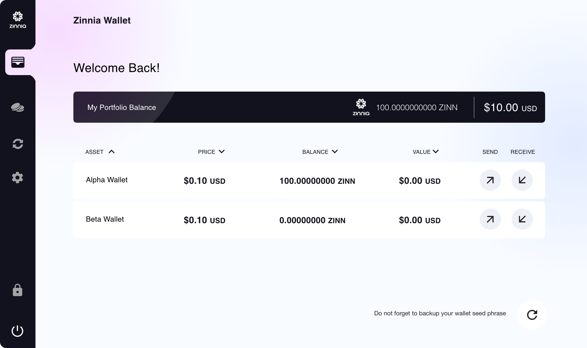

# Core Wallet

**Zinnia Core Wallet (ZCW) contains the entire blockchain and allows users to receive, store, and send digital money, alongside the program, on or with it.**

## Zinnia Core Wallet (ZCW)&#x20;

It's is an open-source application that constitutes a full node of the blockchain network, to run the wallet you will need to download and sync the full zinnia blockchain to your computer.

If you want to support the community, help build the backbone of the network, or are interested in the technical aspects of the network itself we recommend downloading this wallet.

## The Benefits

#### Security&#x20;

ZCW gives you full control of your Zinn and the sole responsibility for backing up and securing your wallet meaning nobody can freeze or lose your funds. ZCW also lets you use Tor as a proxy to prevent hackers or ISPs from connecting your transactions with your IP address.

#### Validation&#x20;

As a full node, ZCW validates and relays transactions on Zinnia Network meaning you don’t have to trust a third party to verify payments.

#### Transparency&#x20;

ZCW is open-source and built deterministically so anyone with the right skills can audit the code to ensure accountability, transparency, and trust.

#### Privacy&#x20;

ZCW prevents spying on your balance and payments by rotating addresses by not disclosing information to network users when sending or receiving a payment.

#### Control&#x20;

ZCW allows you to confirm transactions swiftly without paying unnecessary fees by assessing network conditions and providing current fee estimates.
